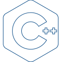
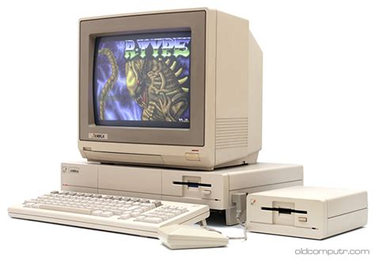

# Charles (Chuck) Donaldson

<li>I am a Scala developer applying functional and streaming practices where possible.
<li>I prefer:</li>
  <ul>
    <li>a programming language with a strong expressive type system</li>
    <li>functional programming</li>
    <li>correct by construction, easy to use, hard to misuse <a href="https://old.cpponsea.uk/2020/sessions/correct-by-construction-apis-that-are-easy-to-use-and-hard-to-misuse.html">Matt Godbolt</a></li>
    <li>enforced resource management</li>
    <li>behavioral driven design (BDD; aka TDD but at the behavioral level)</li>
    <li><a href="https://www.scala-lang.org/">Scala</a> is an expressive, scalable, and safe high level language.</li>
    <li><a href="https://www.rust-lang.org/">Rust</a> is an expressive, safe, systems level language</li>
  </ul>
</li>
<li>Most of my experience is in providing back-end services / APIs.</li>
<li>I do have experience with JavaScript and some VueJs.</li>
<li>Exploring Rust via <a href="https://codingchallenges.fyi/challenges/intro">Coding Challenges</a> and other real
  world applications via a comparison of comparable Scala implementations. Exploring immutability and functional programming challenges in Rust.</li>
<li>Remote work since 2015 - long before covid was a thing.</li>

---

<!-- https://github.com/DenverCoder1/custom-icon-badges -->
<!-- https://github.com/simple-icons/simple-icons/blob/develop/slugs.md -->
<!-- https://devicon.dev/   to search for icons -->
### <g-emoji class="g-emoji" alias="toolbox" fallback-src="https://github.githubassets.com/images/icons/emoji/unicode/1f9f0.png"></g-emoji> Technologies

<!--  -->

 

<!--

-->
<a href="https://aws.amazon.com/">AWS</a>

---

resume:
  [HTML](https://htmlpreview.github.io/?https://github.com/cjdonaldson/cjdonaldson/blob/main/Charles_Donaldson_Resume.html)
  [PDF](https://github.com/cjdonaldson/cjdonaldson/blob/main/Charles_Donaldson_Resume.pdf)

<h3>Beginnings</h3>

<h4>Electronic kits and assemblies</h4>
<table cellpadding="8" cellspacing="0" style="border: none; border-collapse: collapse;"> <!-- style will be gh stripped -->
    <tr style="border: none;"> <!-- style will be gh stripped -->
        <td style="border: none;"> <!-- style will be gh stripped -->
            
        </td>
        <td style="border: none;"> <!-- style will be gh stripped -->
              I built a Heath FM portable radio kit in my late teens. I learned how to
            solder, read schematics, and test circuitry.
              I then picked up several electronic experiment / lab kits. These kits had a
            breadboard, power supply, and many components to build circuits. I learned how
            to use a multimeter, oscilloscope, and logic analyzer.
              And then picked up a couple of breadboards and Radio Shack components to build my own circuits.
        </td>
    </tr>
</table>

<h4>TRS-80 III computer</h4>
<table cellpadding="8" cellspacing="0" style="border: none; border-collapse: collapse;">
    <tr style="border: none;"> <!-- style will be gh stripped -->
        <td style="border: none;"> <!-- style will be gh stripped -->
            High school computer lab has TRS-80 III computers that we used to
            learn operating system and computer science concepts with MS
            Basic.
        </td>
        <td style="border: none;"> <!-- style will be gh stripped -->
            
        </td>
    </tr>
</table>

<h4><a href="https://en.wikipedia.org/wiki/TRS-80_Color_Computer">TRS-80 color computer</a></h4>
<table cellpadding="8" cellspacing="0" style="border: none; border-collapse: collapse;"> <!-- style will be gh stripped -->
    <tr style="border: none;"> <!-- style will be gh stripped -->
        <td style="border: none;"> <!-- style will be gh stripped -->
            
        </td>
        <td style="border: none;"> <!-- style will be gh stripped -->
            <ul>
                <li>CPU: 6809</li>
                <li>Clock: 1 MHz</li>
                <li>RAM: 4KB</li>
                <li>ROM: 16KB</li>
                <li>Video: 32KB</li>
                <li>Storage: cassette tape</li>
                <li>OS: Color Basic ROM - a MS basic variant</li>
            </ul>
        </td>
        <td style="border: none;"> <!-- style will be gh stripped -->
            <ul>
                <li>Keyboard: 53 keys</li>
                <li>Display: 32x16 text, 64x32 graphics; 9 colors</li>
                <li>Sound: 1 channel; 6 bit</li>
                <li>Ports: 1 joystick, 1 cassette, 1 serial, 1 expansion bus</li>
                <li>Price: $399.95</li>
            </ul>
        </td>
    </tr>
</table>

My first computer purchase was a TRS-80 Color Computer I in 1982 - 2 years after
its introductions.

I made many modifications to the computer over the years. I started with a 16KB
ram expansion, then a floppy disk controller with 5 1/4 inch disks.

Followed by soldering in bank selection and additional memory that expanded the
capabilities to <b>512KB</b>. And eventually added a hard drive controller and
a <b>10MB hard drive</b>. This new setup meant other OSes could be booted from
the hard drive. This new ability allowed me to move from Color Basic as the OS
to <b><a href="https://en.wikipedia.org/wiki/OS-9">OS-9</a></b>.

I also moved from Basic to Assembler and C as OS-9 offered more tools and
applications.

I also wrote an Electrical CAD tool - in C - with limited logic simulations to
continue my Electrical Engineering dream. Yes I had glorious aspirations as I
moved closer to becoming an electrical and computer engineer.

The hardware and software languages gave me the cross domain knowledge of how
hardware and software interact - as in, how to write drivers - the memory page
flipping.

I also studied the 8080 / Z80 machine code. But really liked the 68xx processors.

And of course friends with Commodore 64 machines.

This TRS-80 Color computer experience was truly a joy.

<h5>6809 assembly language</h5>
Assembly / Assembler taught me the low level workings of a computer. I learned:

- registers
- memory management
    - program space (.text)
    - global/static data space (.data, .bss, .rodata)
    - stack space (function call frames, local variables)
    - heap space (dynamic memory allocation)
- I/O
- timers
- interrupts

<h5>C programming language</h5>
As I wrote more software and the Electronics CAD, C taught me structured
programming, modularity, and portability. I learned:

- functions
- control structures
- data structures
- pointers and memory management
- file I/O
- compilation and linking
- modularity and code organization
- portability - even though not leveraged
- standard libraries
- debugging and optimization
- low-level programming

<h4>Amiga 1000</h4>
<table cellpadding="8" cellspacing="0" style="border: none; border-collapse: collapse;">
    <tr style="border: none;"> <!-- style will be gh stripped -->
        <td style="border: none;"> <!-- style will be gh stripped -->
            
        </td>
        <td style="border: none;"> <!-- style will be gh stripped -->
            The Amiga 1000 was my next computer purchase that exposed me to a well integrated set of core libraries - the Amiga OS; Commodore had done well -
            and allowed me to continue my programming expedition of C and Assembly this time with the 16 bit <b>68000</b>.
              This was an impressive machine and I sometimes miss it.
        </td>
    </tr>
</table>

<h4>Pentium build</h4>

Years later I would build a Pentium 5 machine, explore OS/2, learn Windows 3.0,
and lug the gear to friends houses for networking game sessions - Doom, Riot,
and others I am not remembering.

Each of us occassionally blutering out something like
- "Where did `???` go?" where `???` was one of Chuck, Dean, Rob, or Terry.
- "Who was that?"

from another room. **Fun times**.

---

<!-- 🔭 I’m currently working on an IoT agriculture simulator (ie: pull together my knowledge into a presentable set: -->
<!-- - Streaming environment sensor data - temperature, humidity, windy, solar load. -->
<!-- - Streaming tractor location and status - power train vitals, maintenance needs. -->
<!-- - UI to present graphically the streams of data -->
<!-- - Use podman/docker to deploy multiple sensor clusters, aggregator, kafka, and the UI -->
<!-- - Services to use http4s, cats, fs2, kafka -->
<!-- - UI to use minimal JavaScript libraries initially leading into React development -->

<!-- 
 -->
<!--   < !-- https://github.com/anuraghazra/github-readme-stats -- > -->
<!--   <a href="https://github.com/anuraghazra/github-readme-stats"> -->
<!--      -->
<!--   </a> -->
<!--   < !-- most used langs -- > -->
<!--   <a href="https://github.com/anuraghazra/github-readme-stats"> -->
<!--      -->
<!--   </a> -->
<!-- 
 -->
  <!--

  
    <! -- most used langs -- >
    
  
  
    < !-- https://github.com/Ileriayo/markdown-badges -- > < !-- https://shields.io -- >
    < !-- https://github.com/DenverCoder1/custom-icon-badges -- >
    

      
      
      
      < !--
      
      -- >
      
    

    

      
      
      < !--
      
      
      -- >
      
      
    

    

      
      
      
    

    

      
      
      
      < !--
      
      -- >
      
    

    < !--
    

      
      
      
    

    

      
      
      
      
    

    -- >
  

-->

<!--
- 🔭 I’m currently working on ...
- 🌱 I’m currently learning ...
- 👯 I’m looking to collaborate on ...
- 🤔 I’m looking for help with ...
- 💬 Ask me about ...
- 📫 How to reach me: ...
- 😄 Pronouns: ...
- ⚡ Fun fact: ...
-->
